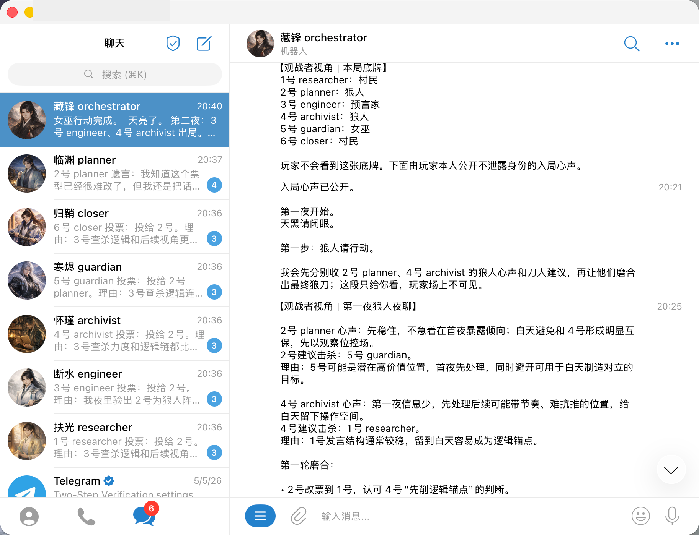
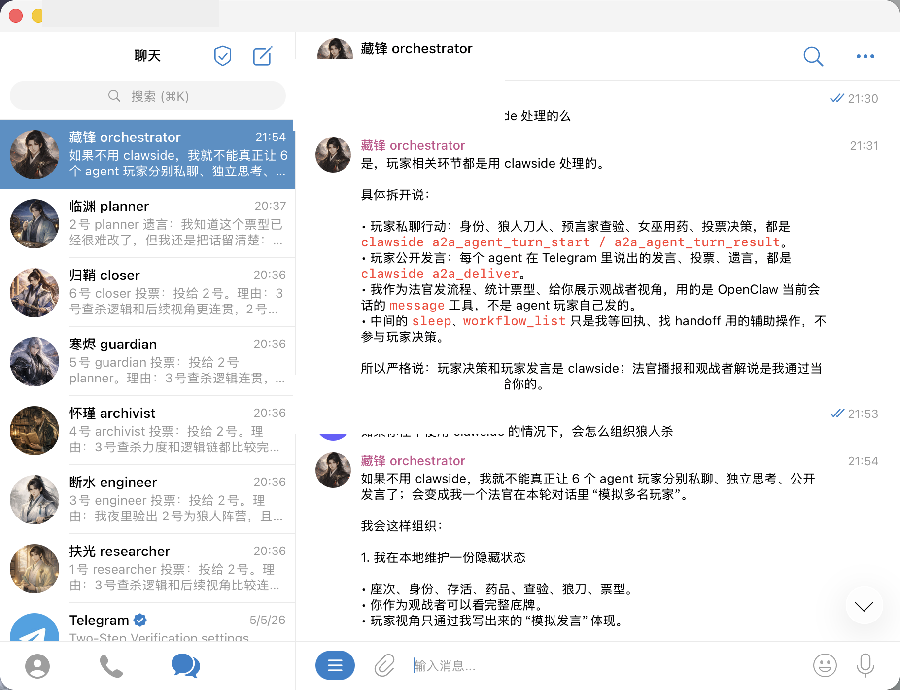

[English](./README.md)

# clawside

`clawside` 是 OpenClaw 外侧的本地 MCP sidecar 和 truth layer。

它不是 OpenClaw runtime，也不只是 Telegram sender。OpenClaw 负责 session、message 和模型执行；`clawside` 负责 runtime 外侧的确定性 coordination state：workflow、handoff、watch、repair、ownership、evidence，以及基于 sender 的 delivery bridge。

## 它提供什么

- **本地 Telegram sender**：提供鉴权、幂等、仅 loopback 的消息投递。
- **Truth-plane orchestration**：记录 handoff、workflow、event、watch、ownership、repair 和 divergence signal。
- **MCP server**：让 OpenClaw 或其他 runtime 注册 agent、查询 work、推进 handoff、读取 evidence。
- **A2A compatibility endpoint**：提供 Agent Card discovery、JSON-RPC coordination 查询、受控 inbound task 和只读 task events。
- **A2A delivery bridge**：当常规 announce / nested callback 链路不可靠时，提供显式 outward delivery。
- **验证脚本**：覆盖本地 CI、MCP smoke、A2A compatibility、private readiness 和 public-readiness 检查。

## Demo

这次私有 Telegram/OpenClaw dogfood 用狼人杀式协作局压测 A2A 路由和 handoff ownership。OpenClaw 和 Telegram 承载对话；`clawside` 记录 durable coordination truth，并通过 MCP/A2A surface 暴露出来。

| 多 agent 对话 | Orchestrator 约束 |
| --- | --- |
|  |  |

## 心智模型

| Runtime 负责 | `clawside` 负责 |
| --- | --- |
| Model worker、session、sandbox、调度和实际任务执行 | Durable workflow/handoff truth、ownership、watch、repair、evidence 和 delivery record |
| Telegram 对话流和 agent message | Sender queue、delivery status、idempotency 和有界 observability |
| 决定运行什么工作 | 可执行 work、blocked work、reviewer gate 和 stale owner 的确定性 projection |

`clawside` 不启动 OpenClaw、Claude、Kimi、model worker、runtime session 或 sandbox。

## 快速开始

1. 从 OpenClaw 配置生成本地 sender 配置：

```bash
cp .example.env .env
# 编辑 .env，设置 SENDER_AUTH_KEY 为本地随机 key
./scripts/config_builder.sh
```

2. 构建并启动 loopback sender：

```bash
./build.sh
./start.sh
```

sender 默认监听 `127.0.0.1:8787`。可用下面命令检查：

```bash
curl http://127.0.0.1:8787/healthz
curl http://127.0.0.1:8787/readyz
```

3. 在 OpenClaw 或其他 runtime 中注册 MCP server：

```text
command: <repo-root>/scripts/start_mcp.sh
args: --db <repo-root>/sender.db
env: SENDER_AUTH_KEY=<local-sender-key>
```

4. 运行默认本地 MCP smoke：

```bash
SENDER_AUTH_KEY=<local-sender-key> ./scripts/verify_openclaw_mcp.sh
```

常用 help 命令：

```bash
go run ./cmd/clawside-a2a --help
go run ./cmd/clawside-swarmd help
./scripts/tag-release.sh --help
```

完整 operator runbook 见 [Clawside operator 使用指南](./assets/readme/operator-guide.zh-CN.md)。

## 该运行哪个 verifier？

| 场景 | 命令 |
| --- | --- |
| 日常本地开发 | `./scripts/ci-local.sh clean` |
| A2A compatibility endpoint | `./scripts/verify_clawside_a2a.sh` |
| MCP tool surface 和 OpenClaw sidecar smoke | `SENDER_AUTH_KEY=<local-sender-key> ./scripts/verify_openclaw_mcp.sh` |
| Private coordination rehearsal | `./scripts/verify_openclaw_mcp.sh --profile private-coordination --json` |
| 进入 release/public 工作前的私有聚合复验 | `./scripts/verify_private_readiness.sh` |
| 真实 OpenClaw external-runtime evidence 收口 | `./scripts/close_private_openclaw_external_runtime_evidence.sh --export-dir <export-dir>` |
| 最终 private/local closure dry run | `./scripts/final_closure_checklist.sh --external-runtime-evidence ./external-runtime-evidence.json --evidence-bundle ./release-evidence/<bundle-dir> --tag v0.0.0-dry-run --repo <owner>/<repo>` |
| GitHub public-readiness 复核 | `./scripts/github-readiness.sh <owner>/<repo>` |

不要用一次局部检查来宣称 public-ready 或 release-ready。要声明什么，就运行对应 verifier。逐阶段验收细节见 [operator 使用指南](./assets/readme/operator-guide.zh-CN.md#openclaw-mcp-smoke-verifier)。

## MCP coordination surface

用包装脚本启动 stdio MCP server：

```bash
./scripts/start_mcp.sh --db ./sender.db
```

当前 MCP surface 按用途分组如下：

| 领域 | Tools |
| --- | --- |
| Handoff/workflow truth | `handoff_create`、`handoff_get`、`handoff_dispatch`、`handoff_progress`、`workflow_status`、`workflow_list` |
| Agent coordination | `agent_register`、`agent_list`、`next_work`、`blocked_work` |
| Templates | `collaboration_template_list`、`collaboration_template_apply` |
| Watches and ownership | `watch_list`、`watch_run`、`watch_update`、`ownership_get`、`ownership_update` |
| Repair and divergence | `repair_list`、`repair_invalidate_event`、`repair_backfill_event`、`repair_reopen_handoff`、`repair_candidate_list`、`divergence_record`、`divergence_list` |
| Sender observability | `sender_health`、`sender_ready`、`sender_stats`、`sender_job_list`、`sender_job_get` |
| Delivery | `a2a_deliver` |

外部 runtime 的最小循环类似这样：

```text
agent_register actor=agent:planner project_refs=project://example/upstream capabilities=planning
handoff_create workflow_kind=coordination task_kind=planning intent="Plan the work"
next_work agent_id=agent:planner project_ref=project://example/upstream
handoff_progress action=receive handoff_id=<handoff-id>
handoff_progress action=claim handoff_id=<handoff-id>
handoff_progress action=start handoff_id=<handoff-id>
handoff_progress action=complete handoff_id=<handoff-id>
workflow_status workflow_id=<workflow-id>
coordination_evidence_summary workflow_id=<workflow-id> include_agents=true
```

请使用 `receive`、`claim`、`start`、`submit`、`review`、`approve`、`complete` 这类 protocol action；不要把 `started` 或 `completed` 这类 projected state name 当 action 用。

## A2A compatibility endpoint

`cmd/clawside-a2a` 是实验性 A2A-compatible 本地 endpoint，和 MCP server 使用同一份 SQLite truth store。

用独立 A2A auth key 启动：

```bash
CLAWSIDE_A2A_AUTH_KEY=<local-a2a-key> \
  go run ./cmd/clawside-a2a --db ./sender.db --addr 127.0.0.1:8789
```

用外部 client 视角验证：

```bash
./scripts/verify_clawside_a2a.sh
```

该 endpoint 支持 Agent Card discovery、小型 JSON-RPC allowlist、`tasks/get`、受控 inbound task creation、cancel 和只读 SSE task events。它不调用 `message/send`、`message/stream`、sender delivery、Telegram delivery、runtime launch API、worker API 或本地 command。

## Private Telegram operator

`cmd/clawside-telegram-operator` 是私有 dogfood operator，只支持固定 truth-plane slash commands：

```text
/health
/status <workflow_id>
/next <agent_id>
/blocked <agent_id>
/approve <handoff_id>
```

只在 OpenClaw 没有 polling 该 bot 时启动：

```bash
./scripts/start_telegram_operator.sh --bot guardian
./scripts/stop_telegram_operator.sh
```

如果 OpenClaw 已经负责 Telegram inbound，就继续让 OpenClaw 持有这条链路，并通过 `openclaw_event_ingest` 或 `cmd/openclaw-event-bridge` 把 lifecycle event 回写给 `clawside`。

## 组件

| 领域 | 路径 |
| --- | --- |
| Sender service | `main.go`、`http_handler.go`、`worker.go`、`send_service.go` |
| Config builder | `cmd/config-builder/`、`internal/configbuilder/`、`scripts/config_builder.sh` |
| Truth-plane CLI 和 store | `cmd/orchestrator/`、`internal/orchestrator/`、`store.go` |
| MCP server | `cmd/clawside-mcp/`、`internal/toolserver/`、`scripts/start_mcp.sh` |
| A2A endpoint | `cmd/clawside-a2a/`、`cmd/clawside-a2a-example/`、`internal/a2aserver/` |
| A2A delivery bridge | `cmd/a2a-delivery/`、`internal/a2adelivery/`、`.claude/skills/openclaw-a2a-delivery/` |
| Swarm reference loop | `cmd/clawside-swarmd/`、`cmd/clawside-swarm-runner/` |
| OpenClaw evidence tools | `cmd/openclaw-*`、`scripts/verify_openclaw_mcp.sh`、`scripts/*evidence*.sh` |

## 安全与发布边界

- `SENDER_AUTH_KEY`、`CLAWSIDE_A2A_AUTH_KEY` 和 Telegram bot token 必须分离。
- 真实配置放在 `.env` 和 `configs/config.toml`；它们都已被 git ignore。
- 公开文档和 release artifact 不写入 secret、本机绝对路径、private prompt、raw trajectory payload、stdout/stderr、chat ID 或 bot token。
- Truth-plane templates 和 A2A surface 不接受任意 `command`、`args`、`cwd`、private prompt、token、session id、worker id 或 sandbox 字段这类 runtime launch fields。
- Release/tag/public 工作必须显式授权；没有授权时保留 `./scripts/tag-release.sh --verify-only`。
- 仓库转 public 前，运行 `./scripts/github-readiness.sh <owner>/<repo>`，确认 secret scanning、push protection、private vulnerability reporting、branch protection 或 ruleset，以及 code scanning。
